# 📊 Excel-2

## ✨ Project Description

**Excel-2** is a guide to the most popular Excel formulas and functions. Here you'll find practical tips, instructions, and illustrations about working with basic functions, Named Ranges, and Paste Special.

> 📚 **Goal:** Help you understand and use the most common Excel features efficiently—perfect for beginners and intermediate users!

---

## 📒 Table of Contents

- [COUNT](#count)
- [SUM](#sum)
- [IF](#if)
- [AVERAGE](#average)
- [COUNTIF](#countif)
- [SUMIF](#sumif)
- [VLOOKUP](#vlookup)
- [MIN and MAX](#min-and-max)
- [SUMPRODUCT](#sumproduct)
- [MOD, ABS, PRODUCT, SQRT](#mod-abs-product-sqrt)
- [Named Ranges](#named-ranges)
- [Paste Special](#paste-special)
- [Screenshots](#screenshots)
- [Requirements](#requirements)
- [Author](#-author)

---

## 🔢 COUNT

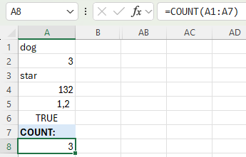

**COUNT** function is used to count the number of cells containing numbers.  
*Note: To count all non-blank cells use COUNTA.*

---

## ➕ SUM

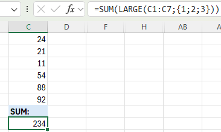

**SUM** function adds up a range of cells.  
In this example, the sum of the top 3 numbers in the range is calculated.  
*Note: The LARGE function returns an array constant {92, 88, 54}. This result is then summed.*

---

## ❓ IF

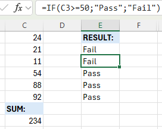

**IF** function checks if a condition is met, returning one value if true and another if false.  
Example: Numbers in range C2:C6 are checked. If they are ≥50, return "Pass", otherwise "Fail".

---

## 📊 AVERAGE

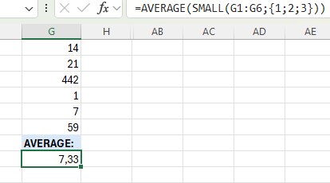

**AVERAGE** calculates the average of a group of numbers.  
Here, the average of the 3 smallest numbers in the range is calculated.  
*Note: The SMALL function returns an array constant {1, 7, 14}.*

---

## 🔍 COUNTIF

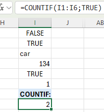

**COUNTIF** counts the number of cells that meet a condition (here: TRUE).

---

## ➕ SUMIF

**SUMIF** sums values in range L1:L6 if the corresponding cells in K1:K6 contain exactly one character plus a star.  
*Note: The `?` symbol matches exactly 1 character.*

---

## 🔎 VLOOKUP

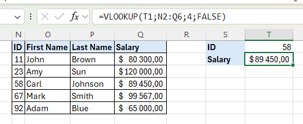

**VLOOKUP** searches for a value in the leftmost column of a table and returns a value in the same row from another column.  
Example: Lookup value is 58 (cell T1).  
*Note: Last argument—FALSE means exact match, TRUE means approximate match.*

---

## 📉 MIN and MAX

 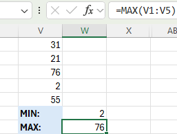

Use **MIN** to find the minimum value and **MAX** to find the maximum value.

---

## ✖️ SUMPRODUCT

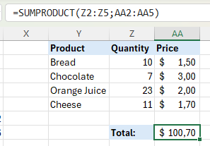

**SUMPRODUCT** calculates the sum of the products of corresponding numbers in one or more ranges.  
Here: (10 × 1.50) + (7 × 3.00) + (23 × 2.00) + (11 * 1,70) = 100,70.

---

## 🧮 MOD, ABS, PRODUCT, SQRT

### MOD and Division

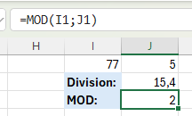

Use `/` for division. To find the remainder, use the **MOD** function.

---

### PRODUCT

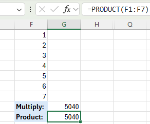

Use `*` or the **PRODUCT** function to multiply numbers. You can also use Paste Special.

---

### SQRT

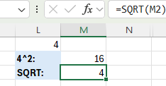

To find the square root, use **SQRT** or raise to the power `^0.5`.

---

### ABS

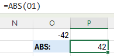

**ABS** removes the minus sign from negative numbers.

---

## 🏷️ Named Ranges

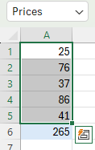

To create a named range:
1. Select the range.
2. Type the name in the Name Box and press Enter.

*Use the Name Manager (Formulas tab > Defined Names group > Name Manager) to view, edit, or delete named ranges or constants.*

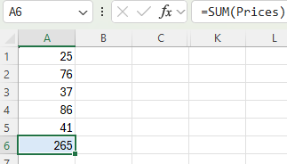

Using a named range in a formula.

### Create From Selection

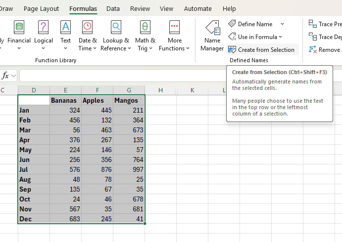

If your data has labels:
1. Select the range (e.g., D1:G13), then in the Formulas tab, Defined Names group, click **Create from Selection**.
2. Choose "Top row" and "Left column" and press OK—Excel will create named ranges automatically.

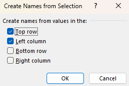
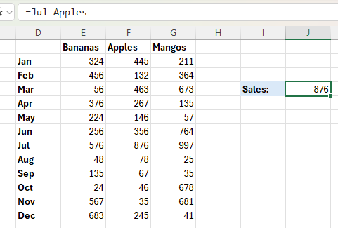
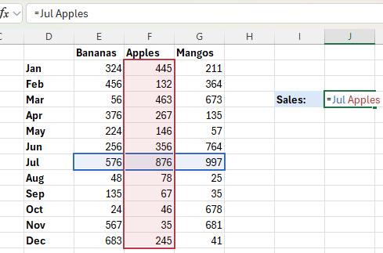

Use the intersect operator (space) to return the intersection of two named ranges.

---

## 📋 Paste Special

You can perform subtraction and other operations using Paste Special.

1. Select cell D9 and press **CTRL + C** to copy.  
   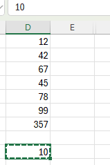
2. Select range D1:D7, right-click and choose **Paste Special**. In the Operation section, check **Subtract**.  
   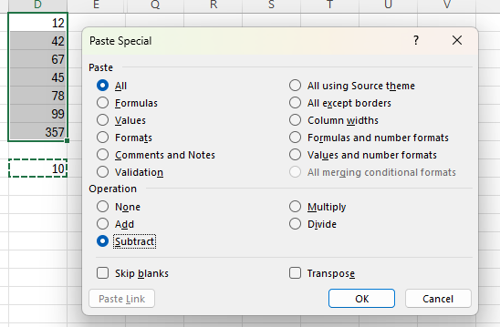
3. See the result:  
   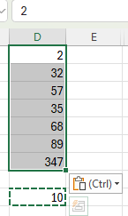

---

## 📷 Screenshots

All screenshots can be found in the `/Screenshots` folder.

---

## ℹ️ Requirements

- Microsoft Excel (recommended: 2021/365 for modern formulas)
- Windows OS

---

## 👨‍💻 Author

Project and documentation by **Kuba27x**  
Repository: [Kuba27x/Excel-2](https://github.com/Kuba27x/Excel-2)

---
