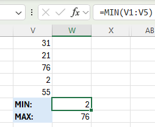

Excel-2

Project description

Excel-2 is a guide to most popular Excel formulas and functions. Here you'll find practical tips, instructions, and illustrations about working with those features, Named ranges and Paste Special. Book2 Excel file consists of 3 sheets: Popular formulas, Other operations and Named Ranges.

Table of Contents

COUNT

COUNT function is used to count the numer of cells containing numbers. (Note: To count all non blank cells use COUNTA)

SUM

In order to sum a range of cells, use the SUM function. In this example we calculate the sum of the top 3 numbers in range. (Note: LARGE function returns array constant {92, 88, 54}. This result is used as an argument for the SUM function)

IF

IF function checks if condition is met. It returns one value if true and another one if false. In this example we check numbers in range C2:C6. If they are greater than or equal to 50 we return Pass, else we return Fail.

AVERAGE

AVERAGE function is used to calculate the average of a group of numebers. In this example we calculate the average of the 3 smallest numbers in range. (NOTE: SMALL function returns array constant {1, 7, 14}. This result is used as an argument for the AVERAGE function)

COUNTIF

COUNTIF function counts the numer of cells that meet the condition; here TRUE.

SUMIF

In this example the SUMIF function sums values in range L1:L6 if the corresponding cells in the range K1:K6 containt exactly 1 character+star. (Note: ? symbol matches exactly 1 character)

VLOOKUP

VLOOKUP function looks as follows: VLOOKUP(lookup_value, table_array, col_index_num, [range_lookup]). In our example lookup value is 58 (cell T1). Function looks for it in the leftmost column of the N2:Q6 range table. The third argument: 4 tells the VLOOKUP function to return the value in the same row from the fourth column of the N2:Q6 table.
(NOTE: last argument: FALSE means exact match and TRUE means approximate match)

MIN and MAX 

Use MIN to find the minimum value and MAX to find the maximum value.

SUMPRODUCT

SUMPRODUCT function is used to calculate the sum of the products of corresponding numbers in one or more ranges. In this example the calculation looks like this: (10 * 1,50) + (7 * 3,00) + (23 * 2,00) + (11 * 1,70) = 100,70

Subtract

There is no official SUBTRACT function in Excel. However there are many other ways to perform this operation.

In this example we subtract 10 from each row of range A1:A7. (Note: We use absolute reference $A$9. This means that when we type =A1-$A$9 in cell B1 and drag the formula down the absoulute reference ($A$9) stays the same while relative reference (A1) changes to A2, A3 etc.)

Paste Special
It is possible to perform subtraction and many other operations using Paste Special feature.
Here is how to do it:

1. Select cell D9 and press CTRL + C to copy.

2. Select range D1:D7, right click and click Paste Special. In operation section check Subtract.

3.Here is the result.

Multiply

To multiply numbers in Excel use * or PRODUCT function. You can also use Paste Special

PRODUCT function.

Division

There's no official DIVIDE function in Excel. Use / symbol to divide numbers. To get the remainder of division, use the MOD function.

MOD function.

Square Root

To square a number multiply it by itself using * symbol or use ^2

SQRT function.

ABS

To remove - sign from negative number use ABS function.

Named Range

To create named range in Excel first select the range and then type the name in the Name Box and press Enter. (Note: You can also create named constant. On the formulas tab in the Defined Names group select Define Name. Enter name, value and press OK. You can now use this named constant in formulas.)
(Note: Use the Name Manager in Excel to view, edit and delete named ranges and named constants. You can find it in the Formulas tab, in the Defined Names group, Name Manager.)

Using Named Range in formula.

Create From Selection

If your data has labels, you can easily create named ranges in Excel.

1. Select the range D1:G13 then on the Formulas tab, in the Defined Names group, click Create from Selection.

2. Select Top row and left column and press OK. Excel created 15 named ranges for you.

3. Use the intersect operator (space) to return the intersection of two named ranges.

